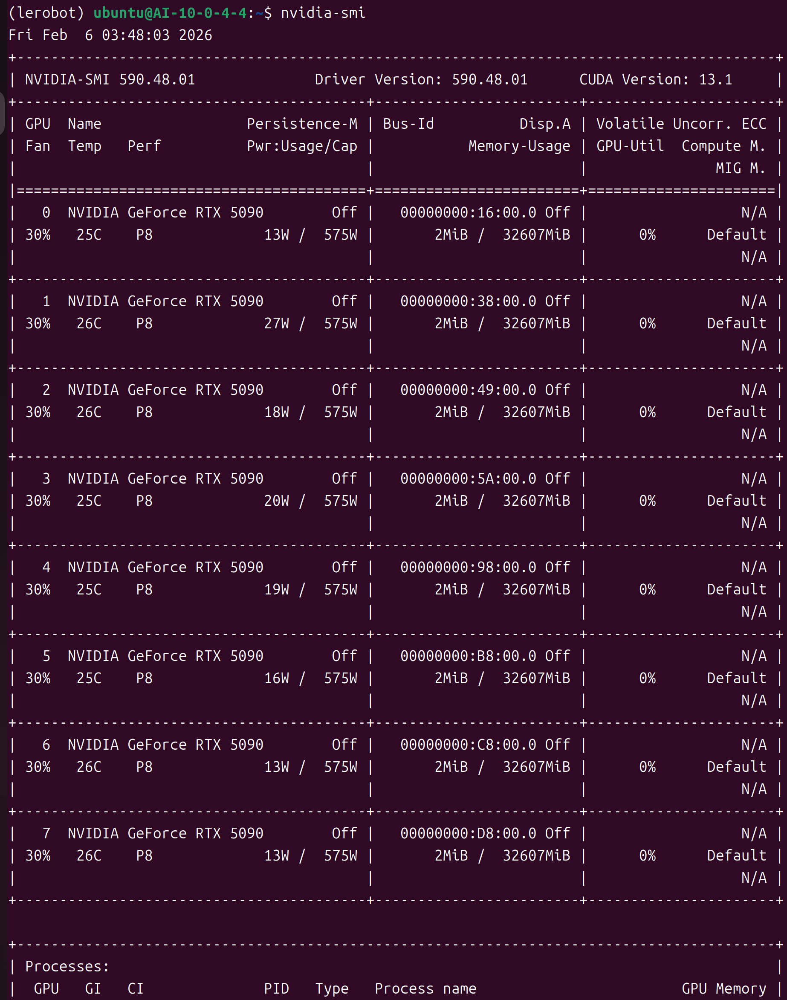
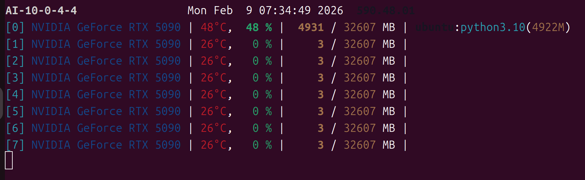
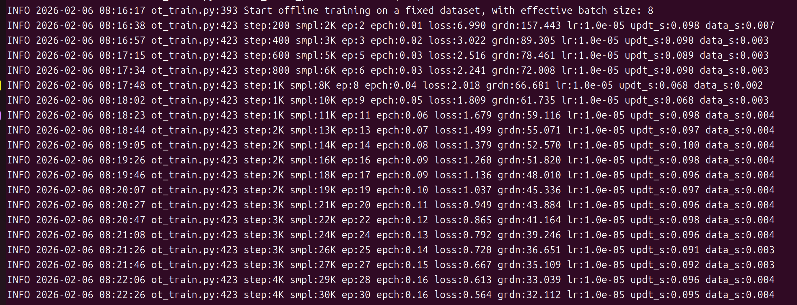

# 基于 5090GPU 和 lerobot 0.4.4 的act模型训练

### 连接到服务器  
>主机  111.0.22.33  
 端口  50004   
 用户名 ubuntu  
 密码 ogh3vq6wbsT5t6fatPCg

打开系统终端，执行以下命令连接到服务器：
```bash
ssh -p 50004 ubuntu@111.0.22.33
```

### 训练数据
数据集路径：/home/ubuntu/dont_touch_my_ball/test/
结构分析：
```bash
/home/ubuntu/dont_touch_my_ball/test/
├── data/                    # 主数据文件（parquet格式）
│   └── chunk-000/
│       ├── file-000.parquet
│       ├── file-001.parquet
│       └── ...
├── meta/                   # 元数据
│   ├── episodes/          # 分块信息
│   ├── info.json          # 数据集信息
│   ├── stats.json         # 统计信息
│   └── tasks.parquet      # 任务信息
└── videos/                # 视频数据（MP4格式）
    ├── observation.images.front/
    └── observation.images.up/
```
- 数据集位置：/home/ubuntu/dont_touch_my_ball/test/
- 数据验证：183个episodes，185,691帧，30 FPS
- 数据结构：包含 action 和 observation.state（均为6维向量）


## 环境配置

```bash
# 设置清华源（解决网络问题）
pip config set global.index-url https://pypi.tuna.tsinghua.edu.cn/simple
pip config set global.trusted-host pypi.tuna.tsinghua.edu.cn
```

### 1. 安装Miniforge
```bash
# 1.下载 Miniforge3 安装脚本
wget "https://github.com/conda-forge/miniforge/releases/latest/download/Miniforge3-$(uname)-$(uname -m).sh"
# 2.运行安装脚本
bash Miniforge3-$(uname)-$(uname -m).sh

# 3.Miniforge安装成功，需要初始化，重启终端才能使环境生效。
```


### 2. 创建虚拟环境
```bash
# 创建名为 lerobot 的虚拟环境
conda create -y -n lerobot python=3.10
# 激活虚拟环境
conda activate lerobot
```


### 3. 安装ffmpeg
```bash
# 1.先激活虚拟环境
# 2.然后安装ffmpeg
mamba install -c conda-forge ffmpeg=6 -y
# 3.检查FFmpeg版本,需要是5,6,7版本
conda list | grep ffmpeg
```


### 4. 更换TorchCodec版本

```bash
# 查看 torchcodec 版本:
pip list | grep torchcodec
# 卸载旧版torchcodec
pip uninstall -y torchcodec
# 清理pip缓存
pip cache purge
# 安装最新的0.6大版本
pip install torchcodec==0.6.*
```


### 5. 安装PyTorch
>5090GPU和lerobot0.4.4共同限制PyTorch版本

选择适合5090GPU的PyTorch版本（可以在PyTorch官网上查看previous versions of PyTorch）
```bash
# 1.先激活虚拟环境
conda activate lerobot

# 2.然后安装PyTorch
pip install torch==2.8.0 torchvision==0.23.0 torchaudio==2.8.0 --index-url https://download.pytorch.org/whl/cu128

# 3.验证PyTorch是否安装成功
python -c "import torch; print(f'PyTorch版本: {torch.__version__}'); print(f'CUDA可用: {torch.cuda.is_available()}'); print(f'GPU数量: {torch.cuda.device_count()}')"
```
理想的验证结果是：第一行显示版本号，第二行显示 True，第三行显示GPU数量。这证明PyTorch和GPU驱动、CUDA兼容性良好。如图所示：


### 6. 克隆lerobot仓库
```bash
# 1. 先激活虚拟环境
# 2. 克隆LeRobot官方仓库（如果网络通畅）
git clone https://github.com/huggingface/lerobot.git
# 3. 进入lerobot目录
cd ~/lerobot
```


### 7. 修改lerobot依赖配置文件
> **目前lerobot 0.4.4 支持torch，torchvision，torchaudio的版本，与5090GPU所要求的版本相冲突！**

修改依赖配置文件 `pyproject.toml`，修改 `torch` `torchvision` `torchaudio`版本限制
```bash
# 1.先激活虚拟环境
# 2.编辑配置文件
cd ~/lerobot
nano pyproject.toml

# 3.默认配置：torch = ">=2.2.1,<2.8.0"，修改为：
torch = ">=2.2.1,<2.9.0"
# 4.默认配置：torchvision = ">=0.21.0,<0.23.0",修改为：
torchvision = ">=0.21.0,<0.24.0"
# 5.默认配置：torchcodec = ">=0.2.1,<0.6.0",修改为：
torchcodec = ">=0.2.1,<0.7.0"
# 6.保存并退出：Ctrl+O → 回车 → Ctrl+X

# 7.确认修改生效
grep -i "torch" pyproject.toml
```


### 8. 安装 LeRobot 完整依赖
```bash
cd ~/lerobot
# 基于修改后的配置安装依赖，不会再降级PyTorch
pip install -e ".[full]" --no-cache-dir

# 验证安装
python -c "import lerobot; print(lerobot.__version__)"
# 预期输出为： 0.4.4
```


### 9. 验证三方兼容
```bash
conda activate lerobot

# 1. 验证 PyTorch 与 GPU 兼容
python -c "
import torch
print(f'PyTorch 版本: {torch.__version__}')
print(f'CUDA 可用: {torch.cuda.is_available()}')
print(f'GPU 数量: {torch.cuda.device_count()}')
print(f'GPU 型号: {torch.cuda.get_device_name(0)}')
"

# 2.验证 LeRobot 导入无异常
python -c "import lerobot; print('lerobot 导入成功')"

# 3. 验证 torchcodec 兼容
python -c "import torchcodec; print('torchcodec 加载正常')"
```


### 10. 添加conda环境库路径
#### （1）验证库文件是否存在
确认 FFmpeg 库文件确实在虚拟环境中，排除文件丢失问题：
```bash
# 查看关键库文件是否存在
ls -l $CONDA_PREFIX/lib/libavutil.so*
```
如果库文件存在，路径应显示为：
```
$CONDA_PREFIX/lib/libavutil.so.56
$CONDA_PREFIX/lib/libavutil.so.57
$CONDA_PREFIX/lib/libavutil.so.58
$CONDA_PREFIX/lib/libavutil.so.59
```
如果库文件不存在，需要重新安装 FFmpeg。

#### （2）添加库路径
**方案1：手动注入库路径（即时生效，首选方案）**
激活虚拟环境后，手动将 Conda 环境的库目录添加到系统共享库搜索路径，执行后直接启动训练：
```bash
# 激活你的虚拟环境（已激活可跳过）
conda activate lerobot
# 临时添加conda环境库路径到LD_LIBRARY_PATH
export LD_LIBRARY_PATH=$CONDA_PREFIX/lib:$LD_LIBRARY_PATH
# 验证路径是否生效
echo $LD_LIBRARY_PATH
```
执行完成后，直接运行你的训练命令，即可解决库加载问题。

**方案2：永久修复（避免每次终端都手动配置）**
将库路径配置写入 Shell 配置文件，后续激活 Conda 环境后自动生效，无需重复执行：
```bash
# 激活虚拟环境
conda activate lerobot
# 将路径导出命令追加到 ~/.bashrc
echo "export LD_LIBRARY_PATH=$CONDA_PREFIX/lib:\$LD_LIBRARY_PATH" >> ~/.bashrc
# 刷新配置，立即生效
source ~/.bashrc
```

**如果想要删除这个配置，执行以下命令：**
```bash
# 打开.bashrc文件
nano ~/.bashrc
# 或
vim ~/.bashrc

# 找到这行并删除：
# export LD_LIBRARY_PATH=$CONDA_PREFIX/lib:\$LD_LIBRARY_PATH
# 保存退出
```
**VIM退出指令：**
|场景|操作步骤	|指令含义|
|---|---|---|
|1. 未修改内容，直接退出|	按 Esc → 输入 :q → 按回车|	:q = quit（退出）|
|2. 修改了内容，保存并退出|	按 Esc → 输入 :wq → 按回车	|:wq = write + quit（保存 + 退出）|
|3. 修改了内容，放弃修改强制退出|	按 Esc → 输入 :q! → 按回车	|:q! = quit + force（强制退出，不保存）|


### 11. 解决Python模块的路径问题
在进行多个GPU训练时，可能会遇到Python模块路径问题。
#### （1）打开终端
```bash
# 先激活虚拟环境
conda activate lerobot
# 进入lerobot目录
cd ~/lerobot
```

#### （2）添加库路径
**方案1：手动注入库路径（即时生效，首选方案）**
```bash
export CUDA_VISIBLE_DEVICES=0,1,2,3,4,5,6,7

export OMP_NUM_THREADS=1

export PYTHONPATH=/home/ubuntu/lerobot:$PYTHONPATH

CONDA_PYTHON="/home/ubuntu/miniforge3/envs/lerobot/bin/python3.10"
```

**方案2：永久修复（避免每次终端都手动配置）**
```bash
# 添加到 ~/.bashrc
# 每次登录时会自动设置
echo 'export CUDA_VISIBLE_DEVICES=0,1,2,3,4,5,6,7' >> ~/.bashrc
echo 'export OMP_NUM_THREADS=1' >> ~/.bashrc
echo 'export PYTHONPATH=/home/ubuntu/lerobot:$PYTHONPATH' >> ~/.bashrc
echo 'export CONDA_PYTHON="/home/ubuntu/miniforge3/envs/lerobot/bin/python3.10"' >> ~/.bashrc
# 刷新配置，立即生效
source ~/.bashrc
```


## act模型训练
> 可打开两个终端，分别登录到服务器，一个用于训练模型，一个用于查看GPU状态。

### 1. 查看GPU状态
#### （1）查看GPU瞬时状态
```bash
# NVIDIA 显卡状态监控工具 nvidia-smi 可以查看当前系统中所有 NVIDIA 显卡的状态信息，包括型号、显存占用、温度、功耗等。
nvidia-smi
```
输出截图为：

#### （2）查看GPU实时状态
**安装可视化工具 gpustat：**
```bash
pip install gpustat
```
**打开 gpustat：**
```bash
gpustat -i -u -c
# -i：显示 GPU 索引；-u：显示占用 GPU 的用户；-c：彩色输出。
# Ctrl+C 退出
```
如图所示：


### 2. 训练模型（单卡）
```bash
# 先激活虚拟环境
conda activate lerobot
# 进入lerobot目录
cd ~/lerobot

# 训练模型
    # steps：训练步数，根据数据集大小和计算资源调整
    # 每次训练输出的output_dir名称不能重复，否则会报错
    # batch_size：批次大小，根据显存大小调整（可以不写，会默认为8）
lerobot-train \
  --dataset.repo_id=dont_touch_my_ball/test \
  --policy.type=act \
  --output_dir=outputs/train/test_$(date +%Y%m%d_%H%M%S) \
  --job_name=dont_touch_my_ball \
  --policy.device=cuda \
  --wandb.enable=false \
  --steps=3000 \
  --batch_size=16
  --policy.push_to_hub=false
```
若成功，会在output_dir目录下生成模型文件，输出类似如下信息：



### 3. 训练模型（多卡）

```bash
$CONDA_PYTHON -m torch.distributed.run \
  --nnodes=1 \
  --nproc_per_node=8 \
  --rdzv_backend=c10d \
  --rdzv_endpoint=localhost:0 \
  src/lerobot/scripts/lerobot_train.py \
  --dataset.repo_id=dont_touch_my_ball/test \
  --policy.type=act \
  --output_dir=outputs/train/8gpu_torchrun_$(date +%Y%m%d_%H%M%S) \
  --job_name=8gpu_torchrun \
  --policy.device=cuda \
  --wandb.enable=false \
  --steps=3000 \
  --batch_size=16
  --policy.push_to_hub=false
```
注意，会出现以下warning，但**不影响训练**：
```bash
[rank2]:[W210 02:49:31.224320614 reducer.cpp:1457] Warning: find_unused_parameters=True was specified in DDP constructor, but did not find any unused parameters in the forward pass. This flag results in an extra traversal of the autograd graph every iteration,  which can adversely affect performance. If your model indeed never has any unused parameters in the forward pass, consider turning this flag off. Note that this warning may be a false positive if your model has flow control causing later iterations to have unused parameters. (function operator())
…………
```

### 参数解析
#### （1）act模型训练参数表
| 参数类别 | 参数名称 | 参数说明 | 推荐值/可选值 |
|---------|---------|---------|--------------|
| **数据集** | `--dataset.repo_id` | 数据集标识符，指向数据目录 | 格式：`数据集名/路径` |
| **模型类型** | `--policy.type` | 使用的策略/模型类型 | `act`, `diffusion`, `vqbet`, `groot`等 |
| **输出目录** | `--output_dir` | 训练输出目录| 任意路径，建议含时间戳 |
| **任务名称** | `--job_name` | 任务标识，用于日志和监控 | 任意字符串 |
| **设备** | `--policy.device` | 模型运行设备 | `cuda`, `cuda:0`, `cpu`, `mps` |
| **W&B日志** | `--wandb.enable` | 是否启用Weights & Biases日志 | `true`/`false` |
| **训练步数** | `--steps` | 训练总步数（迭代次数） | 完整训练：50,000-100,000 |
| **批大小** | `--batch_size` | 每个批次的样本数 | 根据GPU内存调整 |
| **模型发布** | `--policy.push_to_hub` | 是否推送到Hugging Face Hub | `true`/`false` |

#### （2）torch.distributed.run 参数表
| 参数类别 | 参数名称  参数说明 |
|---------|---------|---------|
| **Python解释器** | `$CONDA_PYTHON` | 指定conda环境的Python解释器，确保使用正确环境的Python |
| **Python模块** | `-m torch.distributed.run` | 运行PyTorch分布式启动器模块，替代`torchrun`命令的模块方式 |
| **节点数** | `--nnodes` | 参与的机器/节点数量，单机训练设为1 |
| **每节点进程数** | `--nproc_per_node` | 每个节点的GPU/进程数量，应等于GPU数量 |
| **后端** | `--rdzv_backend`  | 分布式集合通信后端 |
| **端点** | `--rdzv_endpoint` | 分布式协调服务地址和端口，`localhost`表示本机，`:0`自动选端口 |


## 其他操作
### 1. 查看训练输出模型文件目录
查看训练输出模型文件目录
```bash
ls -la outputs/train
```
删除test6模型文件目录
```bash
rm -rf outputs/train/test6
```
删除test6模型文件目录下的部分旧模型文件
```bash
# 假设目录中有 epoch_10.ckpt、epoch_20.ckpt 等旧文件
rm -f outputs/train/test6/epoch_10.ckpt
```
**安全删除注意事项**
- rm -f：强制删除文件，无提示（仅用于文件，不要用于目录）；
- rm -rf：强制递归删除目录及其中所有内容（⚠️ 慎用！删除后无法恢复）；


### 2. 查看GPU状态
```bash
# NVIDIA 显卡状态监控工具 nvidia-smi 可以查看当前系统中所有 NVIDIA 显卡的状态信息，包括型号、显存占用、温度、功耗等。
nvidia-smi
```
输出截图为：

#### 顶部核心信息
```
NVIDIA-SMI 590.48.01        Driver Version: 590.48.01    CUDA Version: 13.1
```
- `NVIDIA-SMI`：NVIDIA 系统管理接口工具，用于查看显卡状态；
- `Driver Version: 590.48.01`：当前显卡驱动版本（属于较新的驱动，适配 RTX 5090）；
- `CUDA Version: 13.1`：驱动**支持的最高 CUDA 版本**（你的服务器可以安装 ≤13.1 的 CUDA 环境）。

#### 显卡列表（8 张 RTX 5090）
每一行对应 1 张显卡（共 8 张，编号 0~7），关键列说明：
| 列名          | 含义（以第 0 张卡为例）|
|---------------|--------------------------------|
| `GPU`         | 显卡编号：`0`（共 8 张，0~7）|
| `Name`        | 显卡型号：`NVIDIA GeForce RTX 5090`（当前旗舰消费级显卡，算力架构为 Ada Lovelace，算力值 ≥8.9）|
| `Fan`         | 风扇转速：`30%`（当前负载低，风扇转速不高）|
| `Temp`        | 显卡温度：`25C`（低温，正常）|
| `Perf`        | 性能模式：`P8`（低功耗待机模式，负载低时自动降频）|
| `Pwr:Usage/Cap` | 功耗：当前 `13W` / 最大 `575W`（负载极低）|
| `Memory-Usage` | 显存占用：`2MiB` / 总 `32607MiB`（约 32GB 显存，几乎未使用）|
| `GPU-Util`    | GPU 利用率：`0%`（无程序在使用 GPU）|